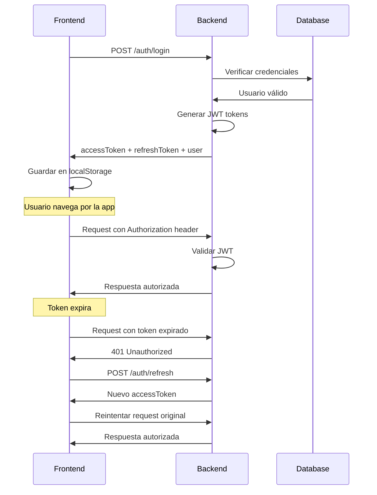

# 📱 Documentación de Integración Frontend - Sistema de Autenticación

## 🔗 **Base URL**
```
http://localhost:3010/system-auth
```

---

## 🔐 **1. LOGIN**

### **Endpoint:**
```http
POST /system-auth/login
```

### **Request Body:**
```json
{
  "correo": "admin@bellavista.com",
  "contraseña": "admin123"
}
```

### **Validaciones:**
- `correo`: Debe ser un email válido (requerido)
- `contraseña`: Mínimo 6 caracteres (requerido)

### **Response Exitoso (200):**
```json
{
  "accessToken": "eyJhbGciOiJIUzI1NiIsInR5cCI6IkpXVCJ9...",
  "refresToken": "eyJhbGciOiJIUzI1NiIsInR5cCI6IkpXVCJ9...",
  "user": {
    "sub": "usr_001",
    "correo": "admin@bellavista.com",
    "nombre": "Juan Carlos García López"
  }
}
```

### **Response Error (400):**
```json
{
  "message": "Credenciales inválidas",
  "error": "Bad Request",
  "statusCode": 400
}
```

---

## 👤 **2. REGISTRO**

### **Endpoint:**
```http
POST /system-auth/register
```

### **Request Body:**
```json
{
  "nombrecompleto": "Juan Carlos García López",
  "usuario": "admin",
  "correo": "admin@bellavista.com",
  "pin": "1234",
  "contraseña": "admin123"
}
```

### **Validaciones:**
- `nombrecompleto`: String (requerido)
- `usuario`: String (requerido)
- `correo`: Email válido (requerido)
- `pin`: Mínimo 4 caracteres (requerido)
- `contraseña`: Mínimo 6 caracteres (requerido)

### **Response Exitoso (201):**
```json
{
  "clienteulid": "01H...",
  "nombrecompleto": "Juan Carlos García López",
  "correo": "admin@bellavista.com",
  "usuario": "admin",
  "esadministrador": false,
  "suspendido": false,
  "fecha_ultimocambio": "2025-09-08T22:00:00.000Z",
  "fecha_sync": "2025-09-08T22:00:00.000Z"
}
```

---

## 🔄 **3. REFRESH TOKEN**

### **Endpoint:**
```http
POST /system-auth/refresh
```

### **Request Body:**
```json
{
  "refreshToken": "eyJhbGciOiJIUzI1NiIsInR5cCI6IkpXVCJ9..."
}
```

### **Response Exitoso (200):**
```json
{
  "accessToken": "eyJhbGciOiJIUzI1NiIsInR5cCI6IkpXVCJ9..."
}
```

### **Response Error (401):**
```json
{
  "message": "Refresh token inválido o expirado",
  "error": "Unauthorized",
  "statusCode": 401
}
```

---

## 🛡️ **4. AUTENTICACIÓN CON JWT**

### **Headers Requeridos:**
```javascript
const headers = {
  'Authorization': `Bearer ${accessToken}`,
  'Content-Type': 'application/json'
}
```

### **Payload del JWT:**
```json
{
  "sub": "usr_001",
  "correo": "admin@bellavista.com", 
  "nombre": "Juan Carlos García López",
  "iat": 1725840000,
  "exp": 1725868800
}
```

---

## 👥 **5. USUARIOS DE PRUEBA**

> ⚠️ **IMPORTANTE**: Estos usuarios deben crearse usando el endpoint `POST /auth/register` antes de poder hacer login.

```json
{
  "usuariosPrueba": [
    {
      "correo": "admin@bellavista.com",
      "contraseña": "admin123", 
      "nombre": "Juan Carlos García López",
      "usuario": "admin",
      "pin": "1234",
      "tipo": "Administrador",
      "esadministrador": true
    },
    {
      "correo": "subgerente@bellavista.com", 
      "contraseña": "subger123",
      "nombre": "María Elena Rodríguez Martínez",
      "usuario": "subgerente1", 
      "pin": "2345",
      "tipo": "Subgerente",
      "esadministrador": false
    },
    {
      "correo": "cajero1@bellavista.com",
      "contraseña": "cajero123", 
      "nombre": "Pedro Sánchez González",
      "usuario": "cajero1",
      "pin": "3456", 
      "tipo": "Cajero",
      "esadministrador": false
    },
    {
      "correo": "mesero1@bellavista.com",
      "contraseña": "mesero123",
      "nombre": "Ana Torres Hernández", 
      "usuario": "mesero1",
      "pin": "4567",
      "tipo": "Mesero",
      "esadministrador": false
    },
    {
      "correo": "cocinero1@bellavista.com",
      "contraseña": "cocinero123",
      "nombre": "Carlos Mendoza Jiménez",
      "usuario": "cocinero1",
      "pin": "5678", 
      "tipo": "Cocinero",
      "esadministrador": false
    }
  ]
}
```

### **🚀 Crear usuarios de prueba:**

```bash
# Ejecutar estos comandos para crear los usuarios:
curl -X POST http://localhost:3010/system-auth/register -H "Content-Type: application/json" -d '{"nombrecompleto":"Juan Carlos García López","usuario":"admin","correo":"admin@bellavista.com","pin":"1234","contraseña":"admin123"}'

curl -X POST http://localhost:3010/system-auth/register -H "Content-Type: application/json" -d '{"nombrecompleto":"María Elena Rodríguez Martínez","usuario":"subgerente1","correo":"subgerente@bellavista.com","pin":"2345","contraseña":"subger123"}'

curl -X POST http://localhost:3010/system-auth/register -H "Content-Type: application/json" -d '{"nombrecompleto":"Pedro Sánchez González","usuario":"cajero1","correo":"cajero1@bellavista.com","pin":"3456","contraseña":"cajero123"}'

curl -X POST http://localhost:3010/system-auth/register -H "Content-Type: application/json" -d '{"nombrecompleto":"Ana Torres Hernández","usuario":"mesero1","correo":"mesero1@bellavista.com","pin":"4567","contraseña":"mesero123"}'

curl -X POST http://localhost:3010/system-auth/register -H "Content-Type: application/json" -d '{"nombrecompleto":"Carlos Mendoza Jiménez","usuario":"cocinero1","correo":"cocinero1@bellavista.com","pin":"5678","contraseña":"cocinero123"}'
```

---

## ⚡ **6. IMPLEMENTACIÓN EN FRONTEND**

### **Servicio de Autenticación (JavaScript/TypeScript):**

```typescript
class AuthService {
  private baseURL = 'http://localhost:3010/system-auth';
  
  async login(correo: string, contraseña: string) {
    const response = await fetch(`${this.baseURL}/login`, {
      method: 'POST',
      headers: {
        'Content-Type': 'application/json',
      },
      body: JSON.stringify({ correo, contraseña })
    });
    
    if (!response.ok) {
      const error = await response.json();
      throw new Error(error.message || 'Error en login');
    }
    
    const data = await response.json();
    
    // Guardar tokens en localStorage
    localStorage.setItem('accessToken', data.accessToken);
    localStorage.setItem('refreshToken', data.refresToken);
    localStorage.setItem('user', JSON.stringify(data.user));
    
    return data;
  }
  
  async register(userData: RegisterData) {
    const response = await fetch(`${this.baseURL}/register`, {
      method: 'POST',
      headers: {
        'Content-Type': 'application/json',
      },
      body: JSON.stringify(userData)
    });
    
    if (!response.ok) {
      const error = await response.json();
      throw new Error(error.message || 'Error en registro');
    }
    
    return await response.json();
  }
  
  async refreshToken() {
    const refreshToken = localStorage.getItem('refreshToken');
    if (!refreshToken) throw new Error('No refresh token available');
    
    const response = await fetch(`${this.baseURL}/refresh`, {
      method: 'POST',
      headers: {
        'Content-Type': 'application/json',
      },
      body: JSON.stringify({ refreshToken })
    });
    
    if (!response.ok) {
      this.logout();
      throw new Error('Session expired');
    }
    
    const data = await response.json();
    localStorage.setItem('accessToken', data.accessToken);
    return data.accessToken;
  }
  
  logout() {
    localStorage.removeItem('accessToken');
    localStorage.removeItem('refreshToken'); 
    localStorage.removeItem('user');
  }
  
  getToken() {
    return localStorage.getItem('accessToken');
  }
  
  getUser() {
    const user = localStorage.getItem('user');
    return user ? JSON.parse(user) : null;
  }
  
  isAuthenticated() {
    return !!this.getToken();
  }
}
```

### **Interceptor para Requests Autenticados:**

```typescript
// Para axios
axios.interceptors.request.use(
  (config) => {
    const token = localStorage.getItem('accessToken');
    if (token) {
      config.headers.Authorization = `Bearer ${token}`;
    }
    return config;
  },
  (error) => Promise.reject(error)
);

// Para fetch
async function authenticatedFetch(url: string, options: RequestInit = {}) {
  const token = localStorage.getItem('accessToken');
  
  const config: RequestInit = {
    ...options,
    headers: {
      'Content-Type': 'application/json',
      ...(token && { Authorization: `Bearer ${token}` }),
      ...options.headers,
    },
  };
  
  const response = await fetch(url, config);
  
  if (response.status === 401) {
    // Token expirado, intentar refresh
    try {
      await authService.refreshToken();
      // Reintentar request original
      config.headers = {
        ...config.headers,
        Authorization: `Bearer ${localStorage.getItem('accessToken')}`,
      };
      return await fetch(url, config);
    } catch {
      authService.logout();
      window.location.href = '/login';
    }
  }
  
  return response;
}
```

---

## 🔧 **7. CONFIGURACIÓN DE TOKENS**

### **Duración de Tokens:**
- **Access Token**: 8 horas
- **Refresh Token**: 7 días

### **Renovación Automática:**
Implementa un interceptor que detecte respuestas 401 y automáticamente intente renovar el token usando el refresh token.

---

## ⚠️ **8. MANEJO DE ERRORES**

### **Códigos de Estado:**
- `200`: Operación exitosa
- `201`: Registro exitoso  
- `400`: Datos inválidos o credenciales incorrectas
- `401`: Token inválido o expirado
- `500`: Error interno del servidor

### **Estructura de Errores:**
```json
{
  "message": "Descripción del error",
  "error": "Tipo de error",
  "statusCode": 400
}
```

---

## 🚀 **9. FLUJO COMPLETO DE AUTENTICACIÓN**



---

## 📝 **10. EJEMPLO DE IMPLEMENTACIÓN REACT**

```jsx
// LoginForm.jsx
import { useState } from 'react';
import { authService } from '../services/authService';

export function LoginForm() {
  const [formData, setFormData] = useState({
    correo: '',
    contraseña: ''
  });
  const [loading, setLoading] = useState(false);
  const [error, setError] = useState('');

  const handleSubmit = async (e) => {
    e.preventDefault();
    setLoading(true);
    setError('');
    
    try {
      await authService.login(formData.correo, formData.contraseña);
      // Redirigir al dashboard
      window.location.href = '/dashboard';
    } catch (err) {
      setError(err.message);
    } finally {
      setLoading(false);
    }
  };

  return (
    <form onSubmit={handleSubmit}>
      <input
        type="email"
        placeholder="Correo electrónico"
        value={formData.correo}
        onChange={(e) => setFormData({...formData, correo: e.target.value})}
        required
      />
      <input
        type="password"
        placeholder="Contraseña"
        value={formData.contraseña}
        onChange={(e) => setFormData({...formData, contraseña: e.target.value})}
        required
      />
      {error && <div className="error">{error}</div>}
      <button type="submit" disabled={loading}>
        {loading ? 'Iniciando sesión...' : 'Iniciar Sesión'}
      </button>
    </form>
  );
}
```

---

**¡Esta documentación está lista para compartir con el equipo de frontend!** 🎉
